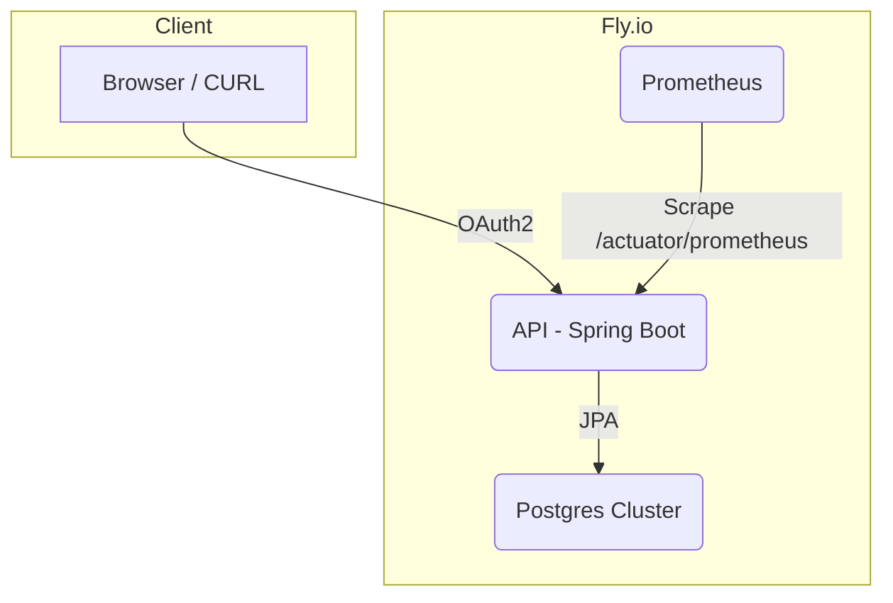

# HobbyHub API  
[](https://github.com/andremunay/HobbyHub-API/actions/workflows/ci.yml)    [](https://hobbyhub-api.fly.dev/swagger-ui/index.html)

HobbyHub API is a personal‐skill tracker designed for hobbyists who want to deepen their expertise and stay motivated. This MVP focuses on two high‐impact modules—Spanish vocabulary and weightlifting—to demonstrate how centralized note‐taking and progress analytics can drive measurable improvement. By capturing flashcard data and workout stats in structured practice journals, the API helps users identify trends, retain knowledge, and apply deliberate practice. Built with Spring Boot and PostgreSQL, the project showcases clean architecture, real-world analytics, and an extensible foundation for lifelong learning.

> **Track your hobbies. Spot progress trends. Ship a production‐grade Spring Boot demo in minutes.**

<p align="center">
  
</p>

---

### Why does HobbyHub exist?

- **Manual practice logs are boring** – spreadsheets kill motivation.  
- **Progress is invisible** – it’s hard to know if you’re actually getting better.  
- **Demo projects are often toy-grade** – this one runs on real infra (Fly.io, Postgres, Prometheus) and shows recruiters I can ship production-ready code.

---

## Secrets & Configuration

- **GitHub**  
  - `OAUTH_CLIENT_ID`  
  - `OAUTH_CLIENT_SECRET`  
  - `GHCR_USERNAME`
  - `GHCR_TOKEN`
- **Fly.io**  
  - `FLY_API_TOKEN`  
  - `JDBC_DATABASE_URL`
  - `SPRING_PROFILES_ACTIVE`
- **Container Registry**  
  - `REGISTRY_USERNAME`  
  - `REGISTRY_PASSWORD`  
- **SonarCloud**
  - `SONAR_ORGANIZATION`
  - `SONAR_PROJECT_KEY`
  - `SONAR_TOKEN`
- **Database**
  - `POSTGRES_DB`
  - `POSTGRES_USER`
  - `POSTGRES_PASSWORD`

---

## Quick start

```bash
# clone & run everything (API + Postgres + Prometheus)
git clone https://github.com/andremunay/hobbyhub-api.git
cd hobbyhub-api
docker compose up --build
```

| Path                                          | Description                   |
| --------------------------------------------- | ----------------------------- |
| `http://localhost:8080/welcome`               | Link hub to every endpoint    |
| `http://localhost:8080/swagger-ui/index.html` | Live OpenAPI docs             |
| `http://localhost:8080/actuator/prometheus`   | Metrics for Prometheus        |
| `http://localhost:9090/`                      | Prometheus UI (graph metrics) |

---

## Developer Docs

* [Swagger UI](https://hobbyhub-api.fly.dev/swagger-ui/index.html) – Live interactive playground

---

## Features

| Module            | What you get                                                |
| ----------------- | ----------------------------------------------------------- |
| **Spanish**       | SM-2 spaced­repetition flashcards (`/flashcards`)           |
| **Weightlifting** | 1-RM analytics & overload trend (`/stats/1rm/{exerciseId}`) |
| **Auth**          | GitHub OAuth2 login (Spring Security 6)                     |
| **Observability** | Structured JSON logs + Micrometer → Prometheus              |
| **CI/CD**         | Maven tests & Fly.io deploy via GitHub Actions              |

> **Live demo:** [https://hobbyhub.fly.dev](https://hobbyhub.fly.dev)
> **3-min walkthrough:** [](TODO-LOOM-URL)

---

## Architecture



---

## Tech stack

| Layer           | Tech                                  | Notes                                      |
| --------------- | ------------------------------------- | ------------------------------------------ |
| Language        | Java 21                               | Eclipse Temurin base image                 |
| Backend         | Spring Boot 3, Spring Security 6      | Modular, hexagonal                         |
| Styling         | Tailwind CSS                          | Atomic-CSS utility framework               |
| DB & Migrations | Postgres 16, Liquibase                | Fly Postgres in prod, Testcontainers in CI |
| Observability   | Micrometer + Prometheus, Logback-JSON | `/actuator/metrics`, structured logs       |
| CI/CD           | GitHub Actions, Fly.io Machines, SonarCloud | Deploy to fly.io, static code analysis & quality gates |
| Tests           | JUnit 5, AssertJ, Testcontainers      | 80 %+ line coverage gate                   |
| Build           | Maven Wrapper                         | Spotless, JaCoCo, Docker multi-stage       |

---

## Code Coverage

We enforce a minimum **80 % instruction coverage** via JaCoCo.
To view the full HTML report:

1. Go to the **Actions** tab → select the latest **CI** run
2. Under **Artifacts**, click **jacoco-report** to download
3. Unzip and open `index.html` in a browser for class-by-class coverage details

---

## Credits

* Huge thanks to Spring, Micrometer, Fly.io, Prometheus, and all open-source libraries used here.

---
